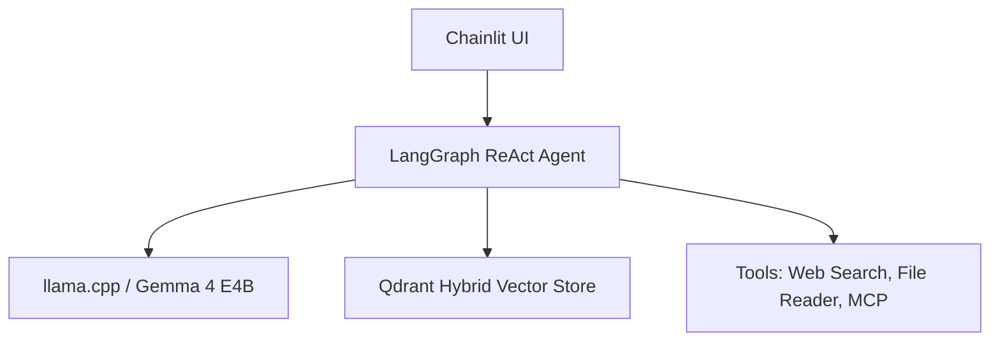

# Multi-modal Agentic RAG Pipeline

A fully local, GPU-accelerated Agentic RAG system built on **Gemma 4 E4B**, **LangGraph**, and **Qdrant**. It provides a multimodal conversational interface capable of document retrieval, visual data extraction, and ReAct agent tool-usage (MCP, Web Search).

## Architecture Overview

- **LLM Engine**: `llama.cpp` serving Gemma 4 E4B (GGUF, GPU accelerated).
- **Orchestration**: LangGraph (ReAct agent architecture, tool chaining).
- **Vector Database**: Qdrant (Dockerized, Hybrid Dense/Sparse retrieval).
- **Embeddings & Reranking**: BGE-M3 (embeds) and BGE Reranker Base.
- **Frontend**: Chainlit (Streaming, Voice STT/TTS, File Uploads).



## Core Features

1. **Hybrid RAG & CRAG**: Combines dense (BGE-M3) and sparse (BM25) MMR retrieval. A grader node validates relevance and falls back to Web Search if context is missing.
2. **Multimodal Processing**: Natively uses Gemma-4 Vision. Uploading a PDF triggers a dual-pass ingestion (Text via PyPDF + Visual via PNG render) stored directly into Qdrant.
3. **Smart Prompt Routing**: Automatically detects content schemas (e.g. Invoices -> JSON, Charts -> Markdown Tables) without extra LLM hops.
4. **Tool Chaining (MCP)**: Directly supports Model Context Protocol (MCP) servers (e.g. GitHub) via `mcp_config.json`. Also features built-in Web Search (Tavily/DuckDuckGo) and Math tools.

## Prerequisites

- **OS:** Linux or macOS
- **Hardware:** NVIDIA GPU (min. 8GB VRAM)
- **Dependencies:** Python 3.12, `uv` package manager, Docker, and `llama.cpp`
- **System Packages:** `poppler-utils` (for PDF rendering), `tesseract-ocr`, `ffmpeg`

## Quick Start

### 1. Installation

```bash
git clone https://github.com/uabali/Multimodel-Agentic-Chatbot.git
cd Multimodel-Agentic-Chatbot
make setup
```

*(This creates the `.venv` using `uv` and generates an `.env` file.)*

### 2. Environment Configuration

Edit the created `.env` file. You must provide the path to your locally compiled `llama-server` binary:

```env
LLAMA_SERVER_BIN=/absolute/path/to/llama-server
TAVILY_API_KEY=your_key_here  # Optional: For Web Search feature
```

### 3. Running the Stack

Open three separate terminal sessions to start the microservices:

```bash
# Terminal 1: Vector Store
make qdrant

# Terminal 2: LLM Engine
make llm

# Terminal 3: UI & Agent
make app
```

Access the UI at: `http://localhost:7860`

## Project Structure

- `src/main.py`: Chainlit UI and application entry point.
- `src/agent/`: LangGraph definitions, ReAct nodes, prompts, and query routers.
- `src/rag/`: Multimodal ingestion (`ingest.py`), BGE-M3 embeddings, Qdrant store, and cross-encoder.
- `src/mcp/`: MCP client loading and `mcp_config.json` specifications.
- `src/tools/`: Custom Python tools (search, file readers, calculator).

## MCP Servers

MCP (Model Context Protocol) extends the agent with external capabilities. Servers are configured in `src/mcp/mcp_config.json`. Set `"disabled": false` (or remove the field) to activate a server, then add the required env vars to `.env`.

| Server | Use Case | Required Env Vars |
|---|---|---|
| `filesystem` | Browse local files outside `uploads/` | `MCP_FILESYSTEM_ROOT` (optional, defaults to `uploads/`) |
| `brave-search` | Web search fallback when Tavily/DDG are unavailable | `BRAVE_API_KEY` |
| `google-calendar` | Summarize upcoming meetings, schedule awareness | `GOOGLE_CLIENT_ID`, `GOOGLE_CLIENT_SECRET` |
| `gmail` | Search/summarize emails combined with RAG | `GOOGLE_CLIENT_ID`, `GOOGLE_CLIENT_SECRET` |
| `github` | Query repos, issues, PRs via natural language | `GITHUB_PERSONAL_ACCESS_TOKEN` |

**Default:** only `filesystem` is active (no API key required). All others have `"disabled": true` — enable them individually as needed.

**Not suitable for MCP:** vector search, embeddings, PDF/image processing, or math — the pipeline already handles these natively.

## Useful Commands

- `make check`: Verifies node health and active loaded models.
- `make tunnel`: Spawns a Cloudflare tunnel for external UI access.
- `make clean`: Removes `.venv`, pycaches, and cached embeddings.
