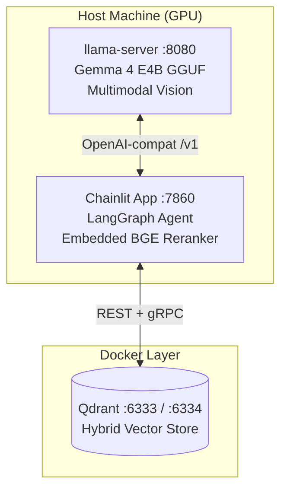

# ☕ Frappe — Multimodal Agentic RAG

[](https://opensource.org/licenses/MIT)
[](https://www.python.org/downloads/release/python-3120/)
[](https://www.docker.com/)

> **Local · GPU-accelerated · Production-ready**
> *Chainlit UI · LangGraph · Qdrant Hybrid Retrieval · Gemma 4 E4B · MCP*

Frappe is a fully local, robust, and multimodal Agentic RAG system built on top of the powerful **Gemma 4 E4B** capabilities. Operating entirely on your own GPU ensures exceptional privacy, while integrating industry-leading tooling out of the box.

Ask insightful questions about your documents, analyze invoices & charts from images, query real-time web data natively, and extend functionality easily with Model Context Protocol (MCP) integrations — all within a single unified conversational experience.

## ✨ Key Features

### 🧠 Advanced Retrieval & Agentic Reasoning
* **ReAct Agent Architecture:** Empowered by LangGraph with strict tool-chaining and fallback behaviors.
* **Hybrid RAG Capabilities:** BGE-M3 (dense) + BM25 (sparse) document retrieval backed by MMR diversity ensuring precise context fetching.
* **CRAG (Corrective RAG) Validation:** An integrated grader assesses context relevance; intelligently falling back to automated web search if initial retrieval is insufficient.
* **Contextual Query Rewriting:** Automatically reconstructs follow-up questions using session conversation history prior to vector searching.
* **Cross-Encoder Reranking:** Integrates the BGE Reranker Base to dramatically increase answer precision.

### 👁️ Multimodal & Vision Capabilities (Gemma 4 Native)
Frappe effortlessly parses visual and textual data.

| Recognition Mode | Trigger Input | Internal Pipeline Execution |
| :--- | :--- | :--- |
| **Vision** | Image strictly | Smart Prompt Auto-Selection ➔ Structured Data Extraction |
| **Vision-Search** | Image + Web Query | Vision Extraction ➔ Dynamic Web Search ➔ Generator Synthesizes Both |
| **Vision-RAG** | Image + Indexed Docs | Vision Extraction ➔ RAG Retrieves DB Constraints ➔ Generator Resolves |
| **Multimodal Ingest**| PDF Upload | Render PDF as PNG per page ➔ Gemma Vision ➔ Embed in Qdrant `visual_description` |

#### Smart Vision Prompting
Frappe bypasses unneeded LLM intermediary routing by inferring content mathematically from constraints. No extra LLM call needed!
* **Invoices/Receipts ➔** JSON structured extractions (`fatura_no`, `toplam`, etc.)
* **Graphs/Charts ➔** Full detailed Markdown table summarizations & trend analysis.
* **Diagrams/Flows ➔** Sequential step-by-step breakdown & component relationship mapping. 

### 🛠️ Built-in Tools & Integrations
* **Search Cascade:** Intelligent web search traversing from Tavily to Brave, ending at DuckDuckGo natively.
* **Computational Safety:** Forces all arithmetic natively through calculator implementations (no LLM "mental math" halluciations).
* **Extensible with MCP:** Readily compatible with Google Calendar, GitHub, and custom setups via standard `mcp_config.json`.
* **In-Session Parsing:** Real-time file reading execution without reloading external processes.

### 🌐 UI & Infrastructure Foundation
* **Chainlit Interface:** Fully features streaming, file upload, and voice inputs.
* **Speech Modules:** Faster-Whisper (STT) and Edge-TTS (Voice). 
* **Statefulness:** Powered under the hood by an asynchronous SQLite conversational layer.
* **Security & Tunnels:** Cloudflare Tunnel embedded implementation `make tunnel` plus active user rate limiting.

---

## 🏗️ System Architecture 

> Runs efficiently across host machines (accelerating the model onto GPUs) and orchestrated Docker environments (managing integrations and vector stores).



**Service Map**
* `llama-server` (Host / GPU) — Port 8080. Powers inferencing capabilities + Gemma vision parsing.
* `chainlit app` (Host / CPU) — Port 7860. The application UI, LangGraph, Embedding modeling and Reranking operations.
* `qdrant` (Docker / CPU) — Port 6333/6334. Hybrid vector store handling structured payloads.

---

## 🚀 Quick Start Guide

### Prerequisites
* **Python 3.12** environment with [uv](https://github.com/astral-sh/uv) installed natively.
* **Docker** & **Docker Compose** actively running.
* **NVIDIA GPU** (8 GB VRAM min ~ 12 GB Recommended) + `llama.cpp` built targeting CUDA.
* `poppler-utils` (Ubuntu) or `poppler` (macOS) on the system to handle PDF conversions optimally.

### 1. Initialize
Clone the repository and set up dependencies:

```bash
git clone https://github.com/your-username/frappe.git
cd frappe
make setup
```

*(This command immediately configures your `.venv` via `uv sync` and duplicates `.env.example` into `.env`.)*

### 2. Configure Environment
Provide the required variable within your freshly generated `.env`:

```env
LLAMA_SERVER_BIN=/absolute/path/to/compiled/llama-server
```
*Optional but recommended: Attach tools for best performance (`TAVILY_API_KEY` for search, `GITHUB_PERSONAL_ACCESS_TOKEN` for repository tools).*

### 3. Launch Services

Populate three independent terminal windows to boot standard microservices natively:

```bash
# Terminal 1: Spin up Qdrant Vector Store
make qdrant

# Terminal 2: Initialize Core Language Model Server (~2.5GB model caching on init)
make llm

# Terminal 3: Bootstrap Application Front-End
make app
```
Navigate to [**http://localhost:7860**](http://localhost:7860) to explore the interface.
Use `make check` anytime to verify all components securely registered.

---

## ⚙️ Configuration Reference (`.env`)

Modify variables within `.env` directly. Below are notable keys available:

| Key | Default | Reference Description |
| :--- | :--- | :--- |
| `LLAMA_SERVER_BIN` | *(Required)* | Exact executable path to local `llama-server`. |
| `LLAMA_HF_REPO` | `lmstudio-community/gemma-4-...` | GGUF Quant target. |
| `LLAMA_CTX_SIZE` | `16384` | Global Context Window Limits. |
| `LLM_BACKEND` | `llama.cpp` | Valid contexts feature `llama.cpp` or `vllm`. |
| `EMBEDDING_MODEL` | `BAAI/bge-m3` | Embedding vector HuggingFace model reference point. |
| `USE_RERANK` | `true` | Toggles BGE cross-encoder active state. |
| `RETRIEVAL_STRATEGY`| `hybrid` | Swap out via `hybrid`, `dense` or `sparse`.|

*(See `.env.example` for comprehensive parameter listings.)*

---

## 📂 Source Anatomy & Project Structure

```text
src/
├── main.py                # Chainlit UI implementation with voice/docs handling
├── config.py              # Pydantic structured env execution
├── tts.py                 # Edge-TTS native pipeline routines
├── agent/                 # Core Agents Architecture
│   ├── graph.py           # LangGraph workflow definition 
│   ├── nodes.py           # Explicit Agent Nodes (Vision, Vision_Search, ...)
│   ├── prompts.py         # Advanced prompt formatting & system prompts
│   └── routing.py         # Routing metrics & fast inference keyword paths
├── rag/                   # Knowledge Infrastructure
│   ├── ingest.py          # Multimodal PDF/Visual doc struct parsers
│   ├── embeddings.py      # BGE-m3 integrations
│   ├── vectorstore.py     # Qdrant Hybrid logic endpoints
│   ├── retriever.py       # Hybrid configuration loader + confidence estimator
│   ├── reranker.py        # CPU-constrained precise ranking cross-encoder
│   ├── query_translation.py# Multi-query expansion methodologies
│   └── llm.py             # DualLLM factory templates 
├── tools/                 # Execution Tools 
│   ├── search.py          # DuckDuckGo and Tavily
│   ├── calculator.py      # Arithmetic sandbox
│   ├── file_reader.py     # In-session system
│   └── mcp_bridge.py      # Universal connector protocols
├── mcp/                   # Model Context Protocol Wrappers
│   ├── mcp_client.py      # Tool initialization mapping 
│   └── mcp_config.json    # Target node setups (e.g., GitHub bindings)
└── middleware/            # Security Protocols (Rate Limiters)
```

---

## 📎 MCP Integration (Model Context Protocol)
Extending tools robustly format via editing `src/mcp/mcp_config.json`. Add execution patterns out-of-the-box seamlessly like so:

```json
{
  "mcpServers": {
    "github": {
      "command": "npx",
      "args": ["-y", "@modelcontextprotocol/server-github"],
      "env": { "GITHUB_PERSONAL_ACCESS_TOKEN": "${GITHUB_PERSONAL_ACCESS_TOKEN}" }
    }
  }
}
```

Tools lazy-load securely into your active session directly against the LangGraph ReAct agent context.

---

## 📜 Development Reference (Make Commands)

Handy `make` abstractions for developers:

* `make setup` - Standardizes virtual deployments natively, synchronizes `uv` dependencies.
* `make qdrant` - Run Qdrant Vector database via compose
* `make llm` - Core LLM binary server wrapper mapping
* `make app` - Boot frontend application directly via configured port binding.
* `make dev` - Checks Node / Docker health constraints explicitly prior to launching frontend.
* `make check` - Readily analyzes overall node stability printing models effectively.
* `make tunnel` - Generate cloudflare pipeline instantly to safely share local interfaces publicly.
* `make stop` - Pause local servers and detach docker cleanly.
* `make clean` - Aggressively shuts off running docker nodes and empties PyCaches recursively.

---

## 📜 License
Distributed securely under the **MIT License**.
